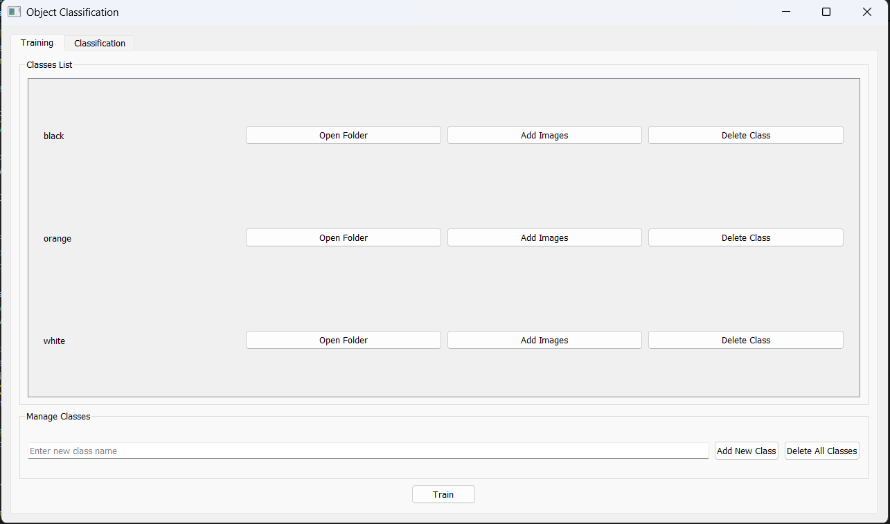
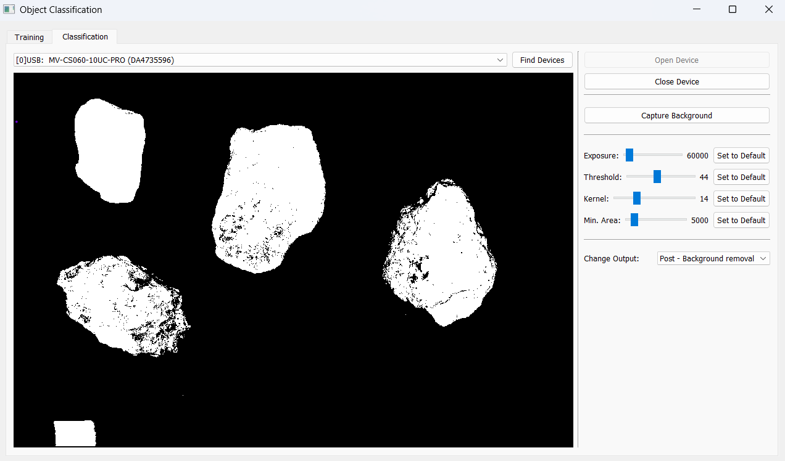
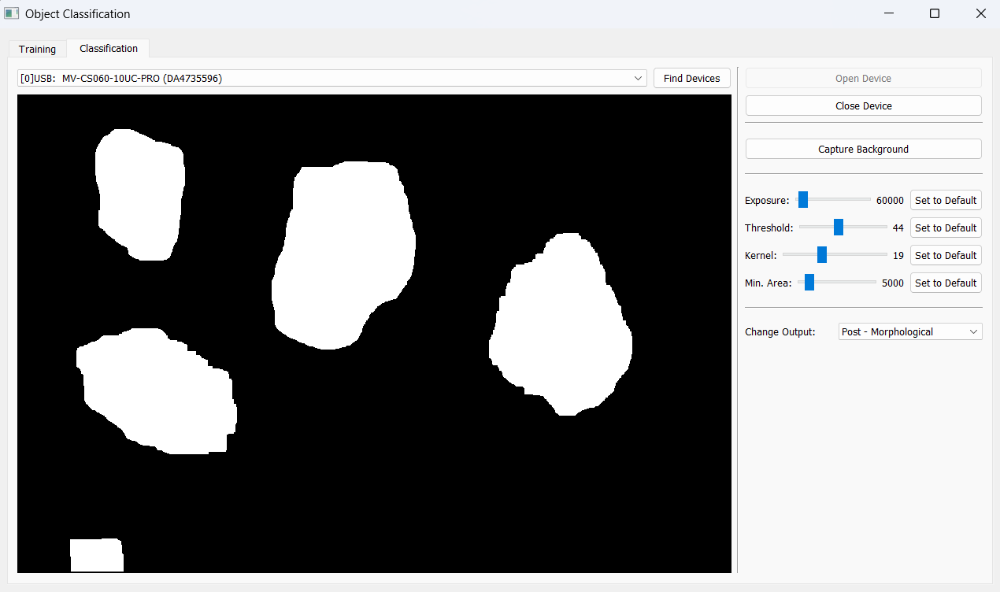
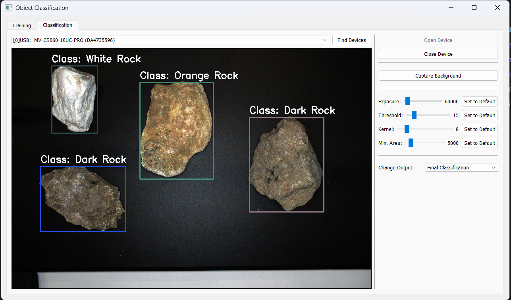

# Object Classification GUI

## 1️⃣ Project Overview
This project is a GUI-based object classification tool that uses OpenCV and PyQt5. It enables users to load images, extract histogram-based features, and train a classification model. The key objectives include:
- Providing a user-friendly interface for image classification.
- Extracting color histograms in HSV format for feature representation.
- Supporting dataset training and classification tasks.
- I used KNN model with k = 3 for classifications, but this can be changed easily.

## 2️⃣ Equipment and Technologies Used

- 📷 Camera Model: Hikrobot MV-CS060-10UC-PRO
- 🔬 Lens: MVL-HF0828M-6MPE
- 🏗 Camera Stand: Aremak Adjustable Machine Vision Test Stand
- 💡 Lighting: Hikrobot Shadowless Ring Light(MV-LGES-116-W)
- 🖥️ Operating System: Windows
- 🔧 Software Tools: Python, OpenCV, Hikrobot SDK, CSV, Pandas, scikit-learn, PyQt5


## 3️⃣ Installation and Running Instructions

1. Clone the repository:
   ```sh
   git clone https://github.com/AlyAsad/Object-Classification-GUI.git
   cd Object-Classification-GUI
   ```
2. Install the required dependencies:
   ```sh
   pip install opencv-python numpy pyqt5
   ```
3. Run the application:
   ```sh
   python main.py
   ```
4. Train the model:
   First, delete the previous classes if there are any, they are there just for testing purposes. Then, add your classes and add their corresponding training images (there are three sample classes/images in the sample_data folder), and then finally click on "Train" button. You won't have to re-train when you reopen the application unless you change the training images.
   
5. Classify:
   In the classification tab, open the connected camera and initially capture the background, so it can be used for background subtraction. Then place objects within the camera frame to classify. You can also change the parameters and view the output after different processing tasks to better understand what's going on and improve accuracy.
  
   
## 4️⃣ Setup/GUI Photos

Image of the camera setup:


Image of the rocks used for training and testing:


Image of training tab:


Images of classification tab:





